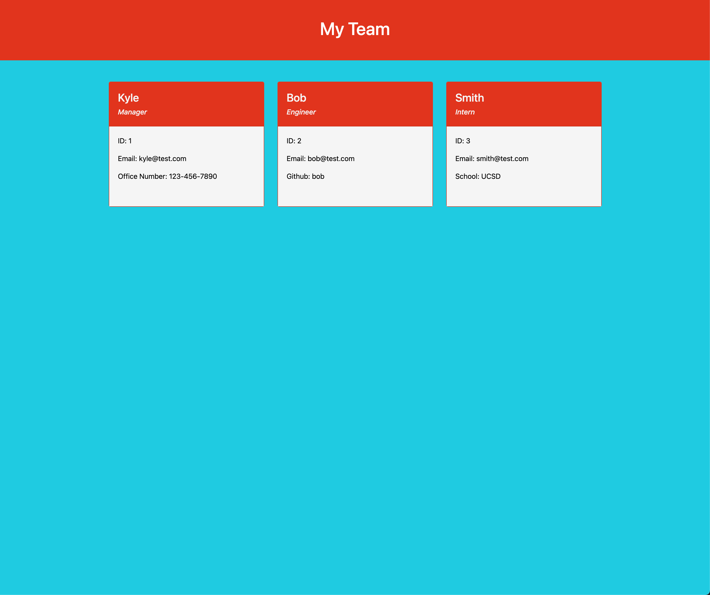

# Team_Profile_Generator

## Description

A Node.js command-line application that takes in information about employees on a software engineering team, then generates an HTML webpage that displays summaries for each person.

## Usage

- [Walkthrough] (https://youtu.be/icfmBOgl1s8)
- [Github](https://github.com/ngolston/Team_Profile_Generator)
- README.md

## Technology

- HTML
- CSS
- Node.js

# NPM's

- [Inquirer](https://www.npmjs.com/package/inquirer)
- [Jest](https://www.npmjs.com/package/jest)

## Credits

- Leah Bolosan
- Dillan Mansor
- Davis Ransom
- Jeffrey Young
- Thao Nguyen
- Parisa Ostovari
- Davis Ransom
- Ricardo Crossley
- Carlos Toledo - Tutor
- And Everyone Else 😁🙏🏾
